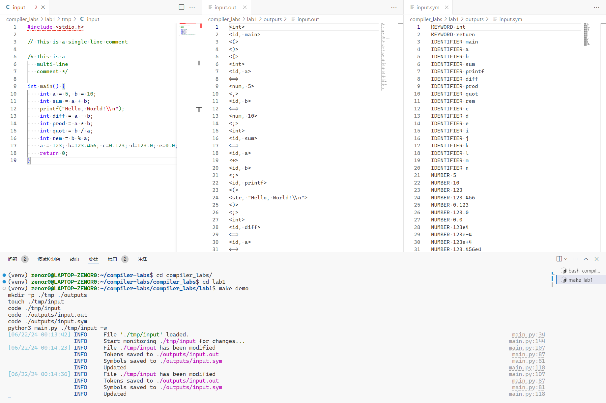
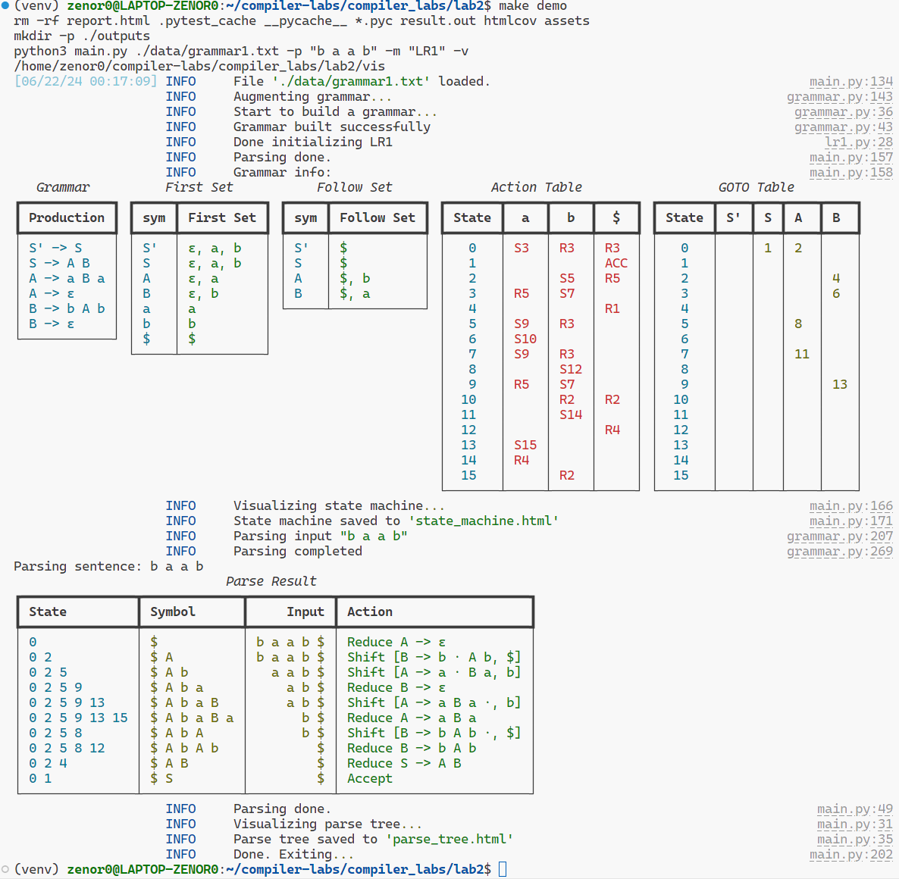
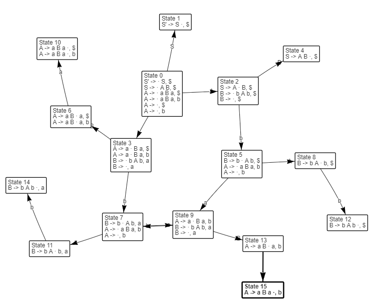
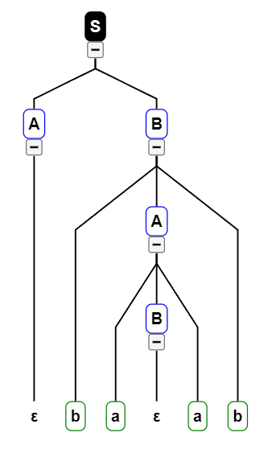
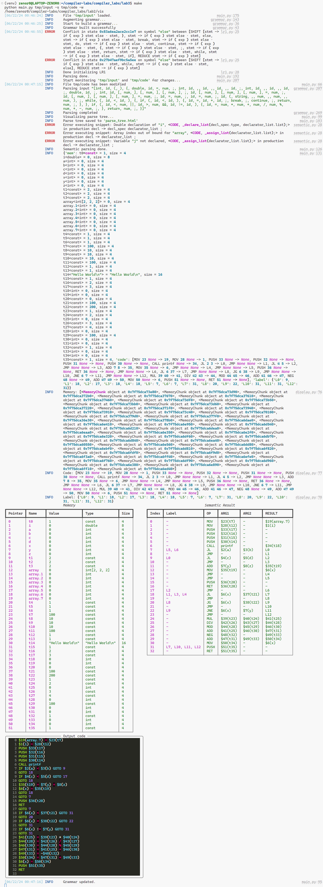

# Compiler Labs Repository

[](https://www.python.org/downloads/release/python-31012/)
[](https://docs.microsoft.com/en-us/windows/wsl/install)
[](./LICENSE)

> [!NOTE]
> This documentation is originally written in Chinese and translated into English using GPT translation. You may find some sentences awkward or difficult to understand. It's very possibly not your fault. Please refer to the original Chinese version for better understanding.

[English](./README.md) | [中文](./README-zhcn.md)

## Introduction

This repository is used to store the experimental code for the Compiler Principles course at Fuzhou University.

The experiments include:

| Experiment Number | Title       | Content                                               |
| ----------------- | ----------- | ----------------------------------------------------- |
| 1                 | Lexical Analysis | Read the source program, recognize words, and output the word symbol table |
| 2                 | Syntax Analysis | Perform syntax analysis on the word symbol table based on grammar rules and output the analysis result |
| 3                 | Semantic Analysis | Perform semantic analysis on the syntax analysis result and output quadruples and three-address code |

## Feature

1. **Lexical Analyzer**

   + Regular expression analysis
   + Output symbol table

2. **Syntax Analyzer**

   + Support custom grammars
   + Detect grammar conflicts (ambiguity)
   + Visualization
     + State machine visualization
     + Syntax analysis tree visualization
   + Output analysis result
     (including FIRST and FOLLOW sets, ACTION table, and GOTO table)

3. **Semantic Analyzer**

   + Support grammars with semantic actions
   + Support custom semantic action functions
   + Support grammar code snippets in Python syntax
   + Generate asm-ish quadruples and three-address code
  
## Preview

### Lexical Analysis



### Syntax Analysis



#### Visualization






## Running the Project

This project is developed based on Python 3.10 on WSL. Please install the relevant dependencies before running.

### Linux

If you are a Linux user, you can use the following command to configure the environment:

```bash
make
```

This command will create a virtual environment and install the dependencies in it. Please manually activate the virtual environment after the installation is complete.

### Windows

>[!WARNING]
> (The project has not been tested on Windows and may have unknown bugs.)

If you are a Windows user and have the `make` command in your system, you can use the following command to configure the environment:

```bash
make
```

If you don't have the `make` command, you can manually execute the following commands:

1. Install the virtual environment

    ```bash
    python -m venv venv
    ```

2. Activate the virtual environment

3. Install the dependencies

    ```bash
    pip install -e .
    ```


## Usage

Detailed usage instructions can be found in the corresponding README.md file in each experiment folder.

You can run

```bash
make demo
```

to run the demonstration provided by each experiment.

> [!WARNING]
> On Windows systems, commands like `touch` and `mkdir` may not be available. Please manually create folders and files as needed.


### Lexical Analysis

After running `make demo`, the program will start listening to the source code files under `./tmp/input` and output the lexical analysis result to `./outputs`.

`input` is the input file, `.out` is the output file, and `.sym` is the symbol table file.


### Syntax Analysis

After running `make demo`, the program will read the `./data/grammar1.txt` file and analyze the Token stream `b a a b` using the `LR(1)` model, and output the syntax analysis result to `./outputs`.


It will also generate visualizations of the state machine and syntax analysis tree. They are saved in `./outputs` in the form of interactive web pages.

#### Visualization

This is the visualization of the state machine


This is the visualization of the syntax analysis tree


In the parse tree, different colors are used to distinguish different types of symbols.

### Semantic Analysis

After running `make demo`, the program will monitor the `./tmp/input` and `./tmp/grammar.txt` files and output the semantic analysis result to `./outputs`.



